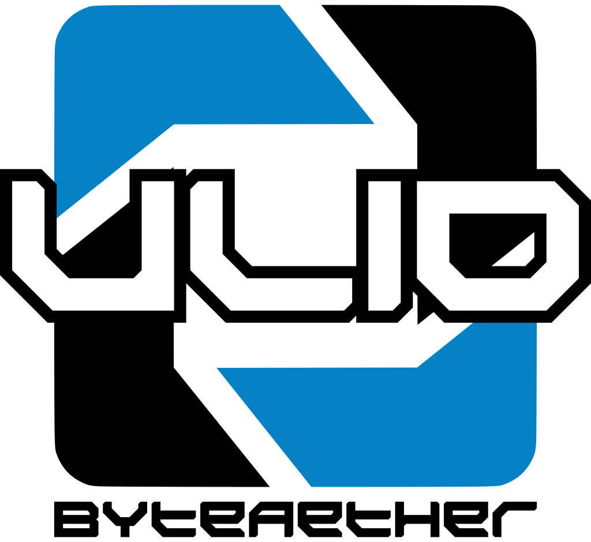

# 

[](https://github.com/ByteAether/Ulid/blob/main/LICENSE)
[](https://www.nuget.org/packages/ByteAether.Ulid/)
[](https://www.nuget.org/packages/ByteAether.Ulid/)
[](https://github.com/ByteAether/Ulid/actions/workflows/build-and-test.yml)
[](https://github.com/ByteAether/Ulid/actions/workflows/codeql.yml)

A high-performance .NET implementation of ULIDs (Universally Unique Lexicographically Sortable Identifiers) that fully complies with the [official ULID specification](https://github.com/ulid/spec).

## Table of Contents

- [Introduction](#introduction)
- [Features](#features)
- [Installation](#installation)
- [Usage](#usage)
- [API](#api)
- [Integration with other libraries](#integration-with-other-libraries)
- [Benchmarking](#benchmarking)
- [Prior Art](#prior-art)
- [Contributing](#contributing)
- [License](#license)

## Introduction



ULIDs are identifiers designed to be universally unique and lexicographically sortable, making them ideal for distributed systems and time-ordered data. Unlike GUIDs, ULIDs are both sortable and human-readable. This library provides a robust and fully compliant .NET implementation of ULIDs, addressing some limitations found in other implementations.

Additionally, this implementation addresses a potential issue in the official specification where generating multiple ULIDs within the same millisecond can cause the "random" part of the ULID to overflow, leading to an overflow exception being thrown. To ensure dependability and guarantee the generation of unique ULIDs, this implementation allows overflow to increment the "timestamp" part of the ULID, thereby eliminating the possibility of randomly occuring exception.

Relevant issue with same suggestion is opened on official ULID specification: [Guarantee a minimum number of IDs before overflow of the random component #39](https://github.com/ulid/spec/issues/39#issuecomment-2252145597)

For almost all systems in the world, both GUID and integer IDs should be abandoned in favor of ULIDs. GUIDs, while unique, lack sortability and readability, making them less efficient for indexing and querying. Integer IDs, on the other hand, are sortable but not universally unique, leading to potential conflicts in distributed systems. ULIDs combine the best of both worlds, offering both uniqueness and sortability, making them an ideal choice for modern applications that require scalable and efficient identifier generation. This library provides a robust and reliable implementation of ULIDs, ensuring that your application can benefit from these advantages without compromising on performance or compliance with the official specification.

## Features


- **Universally Unique**: Ensures global uniqueness across systems.
- **Sortable**: Lexicographically ordered for time-based sorting.
- **Fast and Efficient**: Optimized for high performance and low memory usage.
- **Specification-Compliant**: Fully adheres to the ULID specification.
- **Interoperable**: Includes conversion methods to and from GUIDs, [Crockford's Base32](https://www.crockford.com/base32.html) strings, and byte arrays.
- **Error-Free Generation**: Prevents overflow exceptions by incrementing timestamps during random part overflow.

## Installation

Install the latest stable package via NuGet:

```sh
dotnet add package ByteAether.Ulid
```

Use the `--version` option to specify a [preview version](https://www.nuget.org/packages/ByteAether.Ulid/absoluteLatest) to install.

## Usage

Here is a basic example of how to use the ULID implementation:

```csharp
using System;

class Program
{
    static void Main()
    {
        // Create a new ULID
        var ulid = Ulid.New();

        // Convert to byte array and back
        byte[] byteArray = ulid.ToByteArray();
        var ulidFromByteArray = Ulid.New(byteArray);

        // Convert to GUID and back
        Guid guid = ulid.ToGuid();
        var ulidFromGuid = Ulid.New(guid);

        // Convert to string and back
        string ulidString = ulid.ToString();
        var ulidFromString = Ulid.Parse(ulidString);

        Console.WriteLine($"ULID: {ulid}, GUID: {guid}, String: {ulidString}");
    }
}
```

## API

The `Ulid` implementation provides the following properties and methods:

### Creation

- `Ulid.New(bool isMonotonic = true)`\
Generates a new ULID. If `isMonotonic` is `true`, ensures monotonicity during timestamp collisions.
- `Ulid.New(DateTimeOffset dateTimeOffset, bool isMonotonic = true)`\
Generates a new ULID using the specified `DateTimeOffset`.
- `Ulid.New(long timestamp, bool isMonotonic = true)`\
Generates a new ULID using the specified Unix timestamp in milliseconds (`long`).
- `Ulid.New(DateTimeOffset dateTimeOffset, Span<byte> random)`\
Generates a new ULID using the specified `DateTimeOffset` and a pre-existing random byte array.
- `Ulid.New(long timestamp, Span<byte> random)`\
Generates a new ULID using the specified Unix timestamp in milliseconds (`long`) and a pre-existing random byte array.
- `Ulid.New(ReadOnlySpan<byte> bytes)`\
Creates a ULID from an existing byte array.
- `Ulid.New(Guid guid)`\
Create from existing `Guid`.

### Parsing

- `Ulid.Parse(ReadOnlySpan<char> chars, IFormatProvider? provider = null)`\
Parses a ULID from a character span in canonical format. The `IFormatProvider` is ignored.
- `Ulid.TryParse(ReadOnlySpan<char> s, IFormatProvider? provider, out Ulid result)`\
Tries to parse a ULID from a character span in canonical format. Returns `true` if successful.
- `Ulid.Parse(string s, IFormatProvider? provider = null)`\
Parses a ULID from a string in canonical format. The `IFormatProvider` is ignored.
- `Ulid.TryParse(string? s, IFormatProvider? provider, out Ulid result)`\
Tries to parse a ULID from a string in canonical format. Returns `true` if successful.

### Properties

- `.Time`\
Gets the timestamp component of the ULID as a `DateTimeOffset`.
- `.TimeBytes`\
Gets the time component of the ULID as a `ReadOnlySpan<byte>`.
- `.Random`\
Gets the random component of the ULID as a `ReadOnlySpan<byte>`.

### Conversion Methods

- `.AsByteSpan()`\
Provides a `ReadOnlySpan<byte>` representing the contents of the ULID.
- `.ToByteArray()`\
Converts the ULID to a byte array.
- `.ToGuid()`\
Converts the ULID to a `Guid`.
- `.ToString(string? format = null, IFormatProvider? formatProvider = null)`\
Converts the ULID to a canonical string representation. Format arguments are ignored.

### Comparison operators

- Supports all comparison operators:\
`==`, `!=`, `<`, `<=`, `>`, `>=`.
- Implements standard comparison and equality methods:\
`CompareTo`, `Equals`, `GetHashCode`.
- Provides implicit operators to and from `Guid`.

## Integration with other libraries

### ASP.NET Core
Supports seamless integration as a route or query parameter with built-in `TypeConverter`.

### System.Text.Json
Includes a `JsonConverter` for easy serialization and deserialization.

## Benchmarking
To ensure the performance and efficiency of this ULID implementation, benchmarking was conducted using [BenchmarkDotNet](https://github.com/dotnet/BenchmarkDotNet).

For comparison, [NetUlid](https://github.com/ultimicro/netulid) 2.1.0, [Ulid](https://github.com/Cysharp/Ulid) 1.3.4 and [NUlid](https://github.com/RobThree/NUlid) 1.7.2 implementations were benchmarked alongside.

Benchmark scenarios also include comparisons against `Guid`, where functionality overlaps, such as creation, parsing, and byte conversions.

The following benchmarks were performed:
```
BenchmarkDotNet v0.14.0, Windows 10 (10.0.19045.5247/22H2/2022Update)
AMD Ryzen 7 3700X, 1 CPU, 16 logical and 8 physical cores
.NET SDK 9.0.101
  [Host]     : .NET 9.0.0 (9.0.24.52809), X64 RyuJIT AVX2
  DefaultJob : .NET 9.0.0 (9.0.24.52809), X64 RyuJIT AVX2

Job=DefaultJob

| Type            | Method         | Mean        | Error     | Gen0   | Allocated |
|---------------- |--------------- |------------:|----------:|-------:|----------:|
| Generate        | ByteAetherUlid |  52.6567 ns | 0.1117 ns |      - |         - |
| Generate        | NetUlid *(1)   | 156.6746 ns | 0.5405 ns | 0.0095 |      80 B |
| Generate        | NUlid *(2)     |  72.7365 ns | 0.4196 ns | 0.0124 |     104 B |

| GenerateNonMono | ByteAetherUlid |  92.5597 ns | 0.0494 ns |      - |         - |
| GenerateNonMono | Ulid *(3,4)    |  43.4534 ns | 0.0650 ns |      - |         - |
| GenerateNonMono | NUlid          | 111.1453 ns | 0.1737 ns | 0.0124 |     104 B |
| GenerateNonMono | Guid           |  46.5859 ns | 0.0876 ns |      - |         - |

| FromByteArray   | ByteAetherUlid |   0.0191 ns | 0.0017 ns |      - |         - |
| FromByteArray   | NetUlid        |   0.6626 ns | 0.0047 ns |      - |         - |
| FromByteArray   | Ulid           |   6.8877 ns | 0.0116 ns |      - |         - |
| FromByteArray   | NUlid          |  10.6222 ns | 0.0247 ns |      - |         - |
| FromByteArray   | Guid           |   0.0266 ns | 0.0058 ns |      - |         - |

| FromGuid        | ByteAetherUlid |   1.4260 ns | 0.0023 ns |      - |         - |
| FromGuid        | NetUlid        |   5.1155 ns | 0.0325 ns | 0.0048 |      40 B |
| FromGuid        | Ulid           |   1.6749 ns | 0.0022 ns |      - |         - |
| FromGuid        | NUlid          |  14.0285 ns | 0.0584 ns | 0.0048 |      40 B |

| FromString      | ByteAetherUlid |  14.4420 ns | 0.0361 ns |      - |         - |
| FromString      | NetUlid        |  26.7656 ns | 0.0810 ns |      - |         - |
| FromString      | Ulid           |  14.8101 ns | 0.0499 ns |      - |         - |
| FromString      | NUlid          |  85.7495 ns | 0.5573 ns | 0.0324 |     272 B |
| FromString      | Guid           |  22.3398 ns | 0.1021 ns |      - |         - |

| ToByteArray     | ByteAetherUlid |   3.9530 ns | 0.0337 ns | 0.0048 |      40 B |
| ToByteArray     | NetUlid        |  11.4354 ns | 0.0585 ns | 0.0048 |      40 B |
| ToByteArray     | Ulid           |   4.2924 ns | 0.0246 ns | 0.0048 |      40 B |
| ToByteArray     | NUlid          |   6.5988 ns | 0.0367 ns | 0.0048 |      40 B |

| ToGuid          | ByteAetherUlid |   0.2557 ns | 0.0062 ns |      - |         - |
| ToGuid          | NetUlid        |  11.8685 ns | 0.0424 ns | 0.0048 |      40 B |
| ToGuid          | Ulid           |   0.7235 ns | 0.0012 ns |      - |         - |
| ToGuid          | NUlid          |  11.7772 ns | 0.0501 ns | 0.0048 |      40 B |

| ToString        | ByteAetherUlid |  19.9519 ns | 0.2485 ns | 0.0095 |      80 B |
| ToString        | NetUlid        |  22.4069 ns | 0.1745 ns | 0.0095 |      80 B |
| ToString        | Ulid           |  20.9287 ns | 0.1969 ns | 0.0095 |      80 B |
| ToString        | NUlid          |  52.9361 ns | 0.0952 ns | 0.0430 |     360 B |
| ToString        | Guid           |  11.5112 ns | 0.0107 ns | 0.0115 |      96 B |

| CompareTo       | ByteAetherUlid |   0.0205 ns | 0.0073 ns |      - |         - |
| CompareTo       | NetUlid        |   3.2167 ns | 0.0156 ns |      - |         - |
| CompareTo       | Ulid           |   1.9634 ns | 0.0077 ns |      - |         - |
| CompareTo       | NUlid          |   8.9502 ns | 0.0789 ns | 0.0048 |      40 B |

| Equals          | ByteAetherUlid |   0.0000 ns | 0.0000 ns |      - |         - |
| Equals          | NetUlid        |   1.1434 ns | 0.0083 ns |      - |         - |
| Equals          | Ulid           |   0.0000 ns | 0.0000 ns |      - |         - |
| Equals          | NUlid          |  16.8454 ns | 0.1009 ns | 0.0095 |      80 B |
| Equals          | Guid           |   0.0131 ns | 0.0037 ns |      - |         - |

| GetHashCode     | ByteAetherUlid |   0.0000 ns | 0.0000 ns |      - |         - |
| GetHashCode     | NetUlid        |   9.7179 ns | 0.0457 ns |      - |         - |
| GetHashCode     | Ulid           |   0.0000 ns | 0.0000 ns |      - |         - |
| GetHashCode     | NUlid          |  12.9616 ns | 0.1051 ns | 0.0048 |      40 B |
| GetHashCode     | Guid           |   0.0152 ns | 0.0016 ns |      - |         - |
```
All competitive libraries deviate from the official ULID specification in various ways or have other drawbacks:
  1. `NetUlid`: Can only maintain monotonicity in the scope of a single thread.
  2. `NUlid`: Requires special configuration to enable monotonic generation. You have to write your own wrapper with state.
  3. `Ulid`: Does not implement monotonicity.
  4. `Ulid`: This library uses a cryptographically non-secure `XOR-Shift` random value generation. Only the initial seed is generated by a cryptographically secure generator.

Both `NetUlid` and `NUlid`, which do provide monotonicity, may randomly throw `OverflowException`, when stars align against you. (Random-part overflow)

As such, it can be concluded that this implementation is either the fastest or very close to the fastest ones, while also adhering most completely to the official ULID specification and can be relied on.

## Prior Art

Much of this implementation is either based on or inspired by existing implementations. This library is standing on the shoulders of giants.

  * [NetUlid](https://github.com/ultimicro/netulid)
  * [Ulid](https://github.com/Cysharp/Ulid)
  * [NUlid](https://github.com/RobThree/NUlid)
  * [Official ULID specification](https://github.com/ulid/spec)
  * [Crockford's Base32](https://www.crockford.com/base32.html)

## Contributing

Contributions are welcome! Please follow these steps to contribute:

1. Fork the repository.
2. Create a new branch for your feature or bug fix.
3. Make your changes and commit them with descriptive commit messages.
4. Push your changes to your fork.
5. Open a pull request against the `main` branch of this repository.

## License

This project is licensed under the MIT License. See the [LICENSE](LICENSE) file for details.